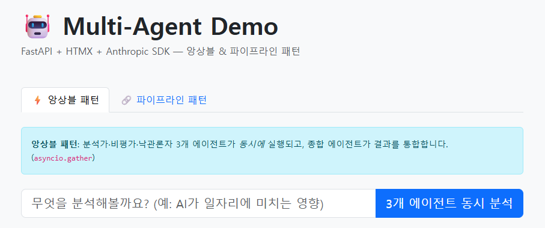

# Overview



Gemini-API를 기반으로 하는 커스텀 에이전트 템플릿. \
다른 프로젝트에서 활용 시 필요에 맞게 떼어쓰도록 구성하였음.
쓴만큼 과금되니 유의!

# Function

- 메인페이지
    - 접근방법 : `(서버 주소)/`
    - Template : `index.html`

- 의사결정용 앙상블 패턴 구성
    - 접근방법 : 메인페이지에서 접속 후 `앙상블 패턴` 클릭
    - 요약 : 3개의 다른 `roled-agents`가 `병렬`적으로 답변 후 `orchestrator-agent`가 답변 정리.
    - 내부기능 : `메모리화`

- 블로그 작성용 기고 파이프라인 패턴 구성
    - 접근방법 : 메인페이지에서 접속 후 `파이프라인 패턴` 클릭
    - 요약 : 5개의 다른 `roled-agents`가 `직렬`적으로 구성되어 답변을 이어받아 최종 답변 도출.
    - 내부기능 : `메모리화`

- 챗봇
    - 접근방법 : `(서버 주소)/chat`
    - Template : `chat.html`
    - 요약 : 1개의 `roled-agent`가 질문과 관련된 `내부 문서`를 활용하여 답변.
    - 특징 : `메모리화`, `RAG`, `현재세션 히스토리 기억`

- 메모리DB 확인
    - 접근방법 : `(서버 주소)/memories`
    - Template : `memories.html`
    - 요약 : `메모리화`된 기억들을 확인하는 장소. 필요에 따라 `전체 삭제` 버튼을 누르거나 `(서버 주소)/memories/clear`에 접근하여 기억을 모두 지울 수 있음.
    - 특징 : `중요도 기반 기억` (cosine similarity)

- 엔드포인트 확인
    - 접근방법 : `(서버 주소)/docs`


# How to use?

### 0. 프로젝트 이동
```cmd
cd (프로젝트 경로)\my-multi-agent
```

### 1. 가상환경 생성 (권장)
```cmd
python -m venv venv
venv\Scripts\activate
```

### 2. 패키지 설치
```cmd
pip install -r requirements.txt
```

### 3. API 키 입력 (.env 파일 수동 생성)
```.env
GEMINI_API_KEY=(sk-ant-여기에_실제_키_입력)
```
* 키 생성은 `https://ai.google.dev/gemini-api/docs/api-key` 참고.

### 4. 서버 실행
```cmd
cd app
uvicorn main:app --reload
```

### 5. 웹 브라우저로 접근
```url
http://localhost:(PORT)/
```

### 6. Enjoy!